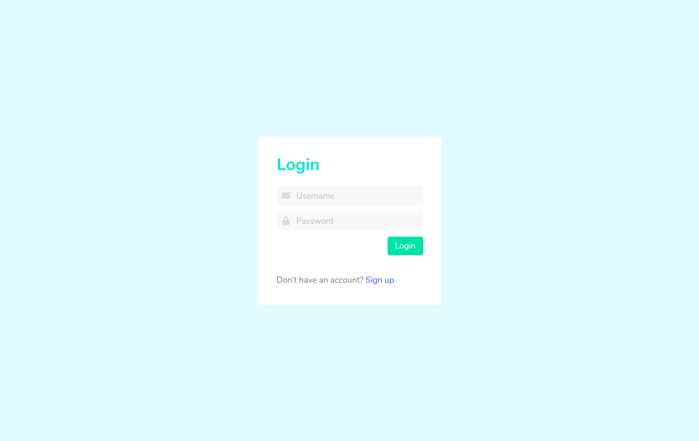
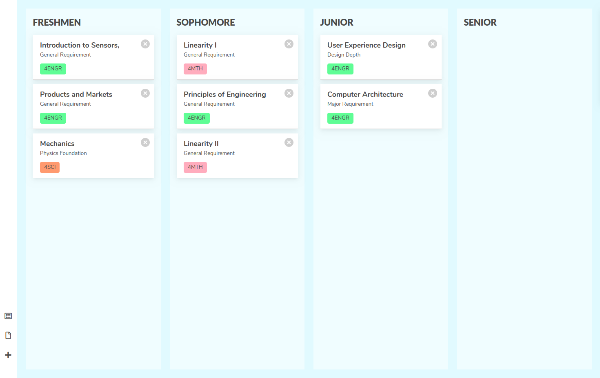
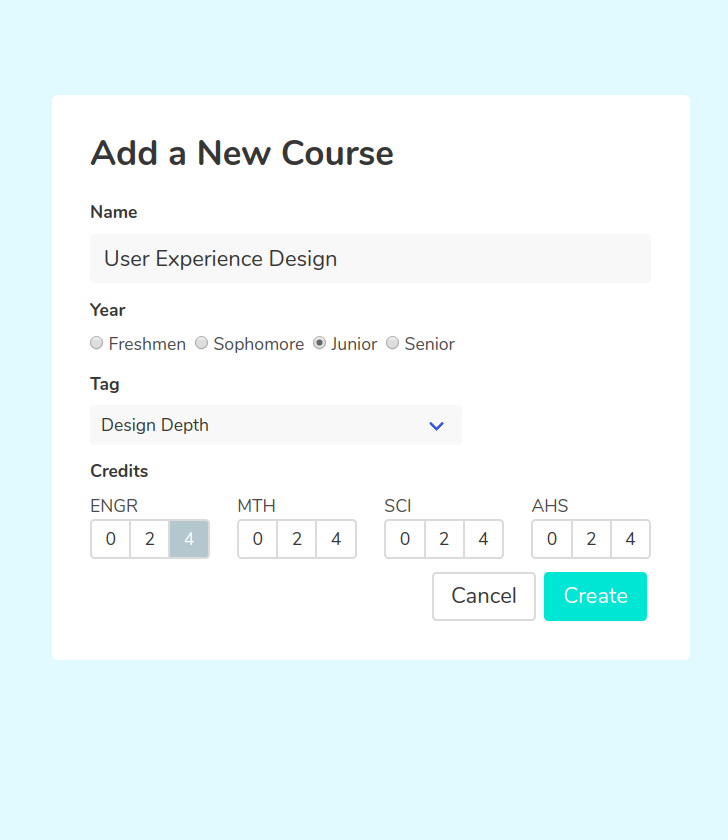
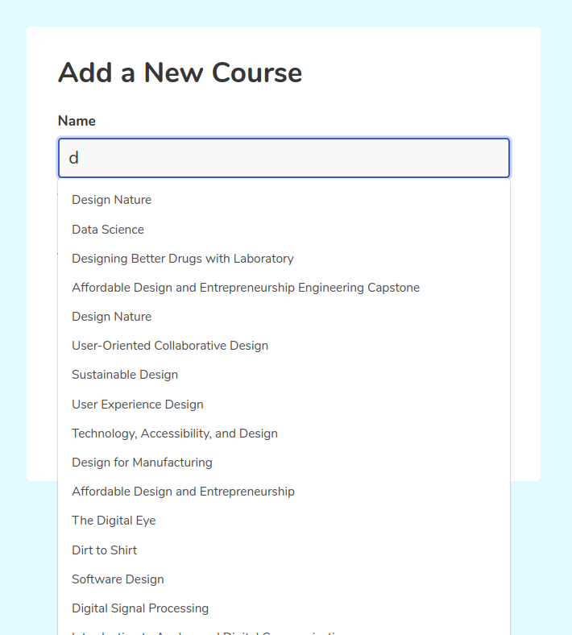

# Scheduler

Visual Course Planner for Olin College courses. This webapp is created with using the MEAN stack and bulma.

## Pages

### Login Page

Login authentication using [jsonwebtoken](https://www.npmjs.com/package/jsonwebtoken). Users can signup with a username and password and use those credentials to log in to a personal account that stores the student's plan.

### Main Board

The main view contains four columns into which course cards can be placed. The columns were created with Angular's drag and drop module to allow dynamic planning and flexibility. Cards can be moved between columns and their order can be rearranged.

### Add Course

The add course form consists of a title field, year, dropdown with requirement options, and credit distribution selection. The name field is implemented with a autosuggest feature that makes a request to the backend each time the text in the input field is changed and returns the course with matching characters.

#### References

- [Task App Example](https://www.youtube.com/channel/UCbwsS1m4Hib6R-9F1alus_A/videos?view=0&sort=dd&shelf_id=1)
- [Search Component](https://medium.com/@nacimidjakirene/angular-search-autosuggest-with-observables-6f42987f80e6)
- [drag and drop](https://material.angular.io/cdk/drag-drop/overview)
- [Bulma](https://bulma.io/)
